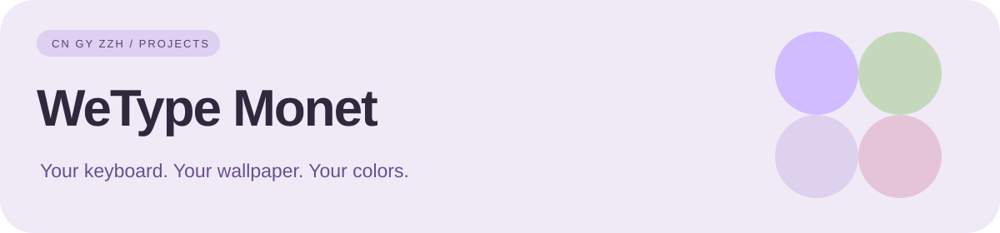

<div align="center">



# 微信输入法 · Monet

跟随系统壁纸的 Material You 动态配色 · Android 14+

[下载发布](https://github.com/CnGyZzh/WeType_Monet-Gy/releases) · [安装](#安装) · [发布产物](#发布产物) · [构建与更新](#构建与更新) · [更新日志](CHANGELOG.md)

</div>

> ⚠️ **个人自用分支**：本仓库为 [@0x1e93d/WeType_Monet](https://github.com/0x1e93d/WeType_Monet) 的 fork，**仅适配微信输入法测试版**，随缘更新、不作长期维护。感谢原作者 [@0x1e93d](https://github.com/0x1e93d) 的开源工作！

## 特性

- 🎨 **Monet 动态色彩** — 键盘、候选栏、工具栏、菜单等界面全部跟随系统 Material You 配色，深浅色自动切换
- 🧩 **两种安装方式** — Magisk / KernelSU Overlay 模块（免改包名、可回滚），或独立 Monet APK（免 Root）
- ⚡ **KernelSU 免重启热更新** — 首次安装后，后续更新热安装即可生效，无需重启设备
- 🧪 **适配微信输入法测试版** — 针对测试版 APK 适配，随缘更新
- 👥 **多用户支持** — KernelSU 安装器可检测多用户环境，按需为其他用户安装
- 🛡️ **可随时回滚** — Overlay 模块卸载即恢复官方原样

## 安装

| 你的环境 | 建议路线 | 注意事项 |
| :--- | :--- | :--- |
| Android 14+ 且有 Magisk / KernelSU | Overlay ZIP | 依赖匹配版本的官方输入法。 |
| 希望使用独立安装包 | Monet APK | 与官方版同包名、不同签名，不能共存；先备份数据。 |

### Magisk / KernelSU Overlay 模块

> 需要 Android 14+，以及已启用的 Magisk 或 KernelSU。模块依赖已安装的官方微信输入法。

1. 在 [Releases](https://github.com/CnGyZzh/WeType_Monet-Gy/releases) 下载最新的 `Wetype_Monet_vN.zip`
2. 用 Magisk 或 KernelSU 安装该 ZIP
3. 重启设备后使用微信输入法

**KernelSU 动态功能：**

- **首次安装需重启** — 首次以静态方式挂载 Overlay；完成一次启动后模块会记录状态
- **后续更新免重启** — 新版本会热安装 Overlay APK 并停止微信输入法进程，重新打开输入法即生效
- **多用户安装** — 检测到其他 Android 用户时可按音量加选择为其安装，并自动启用 Overlay

> 多用户环境中，每个需要使用主题的用户都应已安装官方微信输入法；选择「不安装」时其他用户不会自动获得 Overlay。

### 独立 Monet APK

> 保留官方包名 `com.tencent.wetype`，但使用本项目公开发布签名，**不能与官方微信输入法共存**。

1. 首次安装前，先备份需要保留的输入法数据
2. 卸载当前官方微信输入法
3. 安装 Release 中对应版本的 Monet APK
4. 后续更新直接安装新版本；必须持续使用本项目发布的同一签名版本

> 如需回到官方版本：卸载 Monet APK → 安装同一 Release 提供的官方原始 APK，或从[微信输入法官网](https://z.weixin.qq.com/)下载。

## 发布产物

| 产物 | 说明 |
| --- | --- |
| `Wetype_Monet_vN.zip` | 用于 Magisk / KernelSU 的 Overlay 模块 |
| `Wetype_Monet_<版本>_vN.apk` | 写入 Monet 资源、保持原包名的独立安装包 |
| `Wetype_<版本>.apk` | 构建时下载归档的官方微信输入法原始安装包 |
| `wetype_monet.json` | KernelSU / Magisk 在线更新清单 |
| `CHANGELOG.md` | KernelSU 在线更新界面展示的更新日志 |

> 当前发布工作流会上传 Overlay ZIP、独立 Monet APK 和官方原始 APK；具体可下载文件以对应 Release 的 Assets 为准。请按已安装输入法的版本选择匹配产物。

## 构建与更新

构建脚本与资源映射沿用上游工作，并在本分支进行适配。当前配置支持定时检查、相关源码变更触发，以及手动强制构建。

| 工作流 | 作用 |
| :--- | :--- |
| [Manual force update](.github/workflows/manual-update.yml) | 手动指定 APK 下载地址并强制构建；需要勾选 confirm。 |
| [Auto check WeType version and release](.github/workflows/auto-update.yml) | 定时或相关文件变更时检测、测试、构建并发布。 |
| [Test WeType Monet](.github/workflows/test.yml) | 运行 Python 测试、脚本语法检查与测试构建。 |

### 手动构建

1. 打开 **Actions → Manual force update → Run workflow**。
2. 检查 confirm 与 apk_url。当前表单预填的是测试版 APK 地址，**不等于自动选择官方最新版**；需要其他版本时填写对应下载直链。
3. 等待测试与构建完成，在 Releases 查看产物与适配版本。

### 目录导航

| 路径 | 用途 |
| :--- | :--- |
| [scripts/build.py](scripts/build.py) | APK 下载、资源映射、构建和产物生成。 |
| [config](config) | 基础配置、版本映射与发布状态。 |
| [overlay](overlay) | Overlay 清单与资源。 |
| [module_template](module_template) | 模块安装与启动脚本。 |
| [tests](tests) | 构建逻辑测试。 |

本地运行映射测试（Python 3.11）：

```sh
python -m unittest discover -s tests -v
```

完整构建另需 Java 17、Android SDK、Apktool、zipalign 与 apksigner 等工具，依赖安装步骤以构建工作流为准。

## 常见问题

<details>
<summary><b>为什么需要 Android 14+？</b></summary>

Monet 动态取色依赖 Android 12+ 的 Material You，而本项目的 Overlay 目标与系统资源引用基于 Android 14 的接口设计，因此要求 Android 14 及以上。
</details>

<details>
<summary><b>微信输入法更新后主题失效了怎么办？</b></summary>

等待本分支 Release 适配新版本后更新即可；如测试版变化较大，作者会随缘更新适配。
</details>

<details>
<summary><b>独立 APK 和 Overlay 模块该选哪个？</b></summary>

- 已 Root（Magisk / KernelSU）→ 优先用 **Overlay 模块**，免改包名、易回滚
- 未 Root → 用 **独立 Monet APK**，但需卸载官方版且不能共存
</details>

## 许可证

本项目基于上游 [@0x1e93d/WeType_Monet](https://github.com/0x1e93d/WeType_Monet) 修改。

[GPL-3.0](LICENSE) © [0x1e93d](https://github.com/0x1e93d)


## CnGyZzh Ecosystem

**[CnGyZzh Profile](https://github.com/CnGyZzh/CnGyZzh)** · **[Level](https://github.com/CnGyZzh/Level)** · **[HyperMax](https://github.com/CnGyZzh/HyperMax)** · **[ZEEHO Auto](https://github.com/CnGyZzh/ZEEHO-Auto-Gy)**

> 项目索引与公开活动统一由 **Level** 汇总，个人主页由 **CnGyZzh** 作为展示入口。
